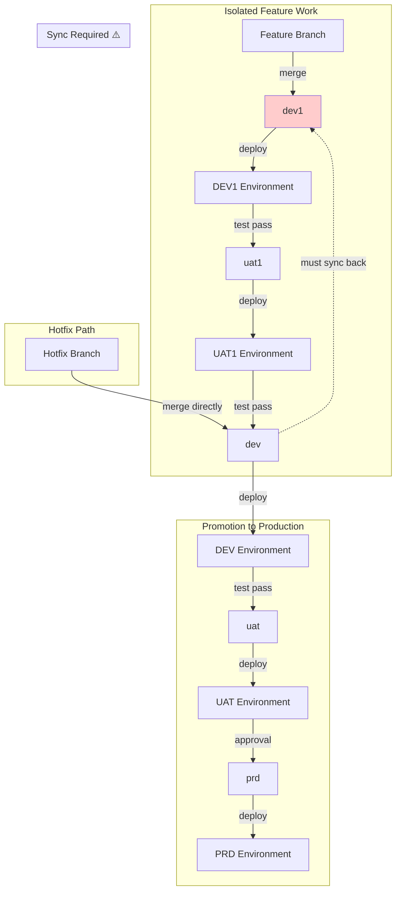
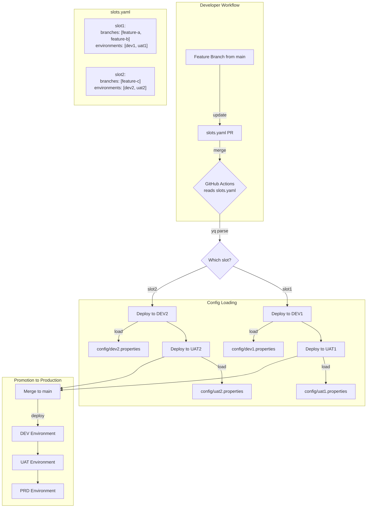
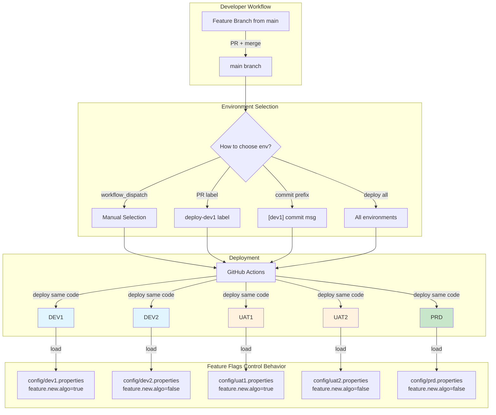
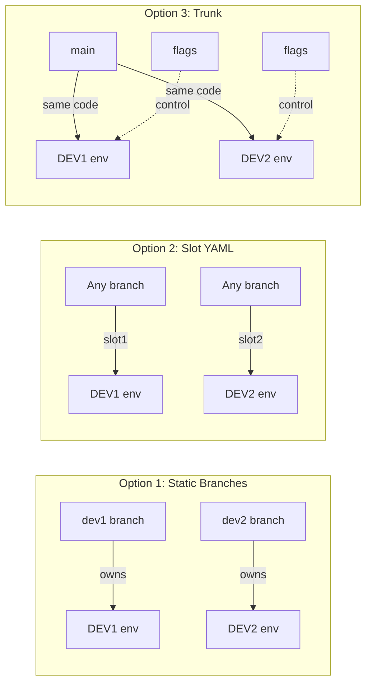
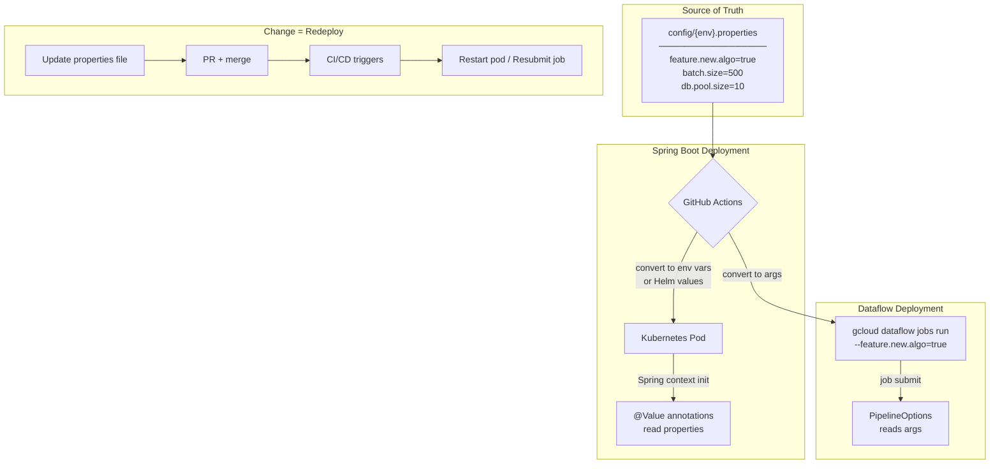

# Deployment Strategy Flows

## Option 1: Static Branches

---

## Option 2: Slot YAML

---

## Option 3: Trunk-Based + Feature Flags

---

## Comparison: Environment Isolation

---

## Config Flow: Spring Boot + Dataflow

