# Trunk-Based Development with Feature Flags

## Overview

This model uses a single `main` branch as the source of truth in each repository. The **same code artifact** is deployed to multiple GKE namespaces or pushed as Dataflow Flex Templates to different GCS buckets - each with **environment-specific configuration** including BigQuery datasets, DAG names, and feature flags.

---

## GKE Application Flow

```mermaid
---
title: GKE Application - Trunk-Based with Feature Flags
---
flowchart TD
    subgraph GKE_REPO["GKE Application Repository"]
        A1[Feature Branch] -->|PR + Code Review| B1[main branch]
        CODE1["⚠️ Feature Flag in Code<br/>────────────────────<br/>if (featureFlags.isEnabled('new-algo')) {<br/>  // new implementation<br/>}"]
        A1 -.->|must add| CODE1
    end
    
    subgraph GKE_CICD["GitHub Actions - GKE Pipeline"]
        B1 --> E1[Build & Test]
        E1 --> ART[📦 Docker Image]
    end
    
    subgraph GKE["GKE Cluster - Same Image, Different Namespaces"]
        ART -->|deploy| NS1[namespace-1]
        ART -->|deploy| NS2[namespace-2]
        
        NS1 -->|load ConfigMap| CFG1["config/ns1.yaml<br/>─────────────────<br/>bq.dataset: dataset_ns1<br/>composer.dag: dag_ns1<br/>feature.new-algo: true"]
        
        NS2 -->|load ConfigMap| CFG2["config/ns2.yaml<br/>─────────────────<br/>bq.dataset: dataset_ns2<br/>composer.dag: dag_ns2<br/>feature.new-algo: false"]
    end
    
    subgraph GKE_Resources["Namespace-1 Resources"]
        CFG1 --> R1["BigQuery: dataset_ns1<br/>Composer: dag_ns1_*<br/>PubSub: topic-ns1-*"]
    end
    
    subgraph GKE_Resources2["Namespace-2 Resources"]
        CFG2 --> R2["BigQuery: dataset_ns2<br/>Composer: dag_ns2_*<br/>PubSub: topic-ns2-*"]
    end

    %% Styling
    classDef namespace fill:#4a90d9,stroke:#2c5282,color:white
    classDef config fill:#f7fafc,stroke:#a0aec0,color:#1a202c
    classDef main fill:#9f7aea,stroke:#6b46c1,color:white
    classDef artifact fill:#48bb78,stroke:#276749,color:white
    classDef resource fill:#fc8181,stroke:#c53030,color:white
    classDef code fill:#faf089,stroke:#d69e2e,color:#744210

    class NS1,NS2 namespace
    class CFG1,CFG2 config
    class B1 main
    class ART artifact
    class R1,R2 resource
    class CODE1 code
```



---

## Dataflow Flex Template Flow

```mermaid
---
title: Dataflow Flex Template - Trunk-Based with Feature Flags
---
flowchart TD
    subgraph DF_REPO["Dataflow Repository"]
        A2[Feature Branch] -->|PR + Code Review| B2[main branch]
        CODE2["⚠️ Feature Flag in Pipeline Options<br/>────────────────────────────<br/>@Default.Boolean(false) ← REQUIRED<br/>Boolean getFeatureNewAlgo();"]
        A2 -.->|must add with default| CODE2
    end
    
    subgraph DF_CICD["GitHub Actions - Dataflow Pipeline"]
        B2 --> E2[Build & Test]
        E2 --> FLEX[📦 Flex Template JAR]
    end
    
    subgraph Buckets["GCS Buckets - Same Template"]
        FLEX -->|push| BKT1["gs://project-flex-ns1/"]
        FLEX -->|push| BKT2["gs://project-flex-ns2/"]
    end
    
    subgraph Composer["Cloud Composer DAGs Launch Jobs"]
        DAG1["dag_ns1_workflow<br/>─────────────────<br/>DataflowStartFlexTemplateOperator<br/>parameters={<br/>  'featureNewAlgo': 'true',<br/>  'outputDataset': 'dataset_ns1'<br/>}"]
        
        DAG2["dag_ns2_workflow<br/>─────────────────<br/>DataflowStartFlexTemplateOperator<br/>parameters={<br/>  flag not passed,<br/>  'outputDataset': 'dataset_ns2'<br/>}"]
        
        BKT1 -->|template location| DAG1
        BKT2 -->|template location| DAG2
    end
    
    subgraph Jobs["Dataflow Jobs"]
        DAG1 -->|launches| JOB1["job-ns1<br/>featureNewAlgo=true ✅"]
        DAG2 -->|launches| JOB2["job-ns2<br/>uses default: false ✅"]
    end
    
    subgraph Result["Outcome"]
        JOB1 -->|runs| NEW["🆕 New Algorithm"]
        JOB2 -->|runs| OLD["📦 Existing Algorithm"]
    end

    %% Styling
    classDef bucket fill:#ed8936,stroke:#c05621,color:white
    classDef main fill:#9f7aea,stroke:#6b46c1,color:white
    classDef artifact fill:#48bb78,stroke:#276749,color:white
    classDef dag fill:#4299e1,stroke:#2b6cb0,color:white
    classDef job fill:#4a90d9,stroke:#2c5282,color:white
    classDef newpath fill:#48bb78,stroke:#276749,color:white
    classDef oldpath fill:#a0aec0,stroke:#718096,color:white
    classDef code fill:#faf089,stroke:#d69e2e,color:#744210

    class BKT1,BKT2 bucket
    class B2 main
    class FLEX artifact
    class DAG1,DAG2 dag
    class JOB1,JOB2 job
    class NEW newpath
    class OLD oldpath
    class CODE2 code
```



---

## ⚠️ Critical: Default Values Prevent Job Failures

When adding a new feature flag to code, **always set a default value**. This ensures existing launch scripts and Composer DAGs continue working without modification.

### What Happens Without Defaults

| Scenario | Flag Has Default | Result |
|----------|------------------|--------|
| New flag added, ns1 passes it | ✅ Yes | Works - uses passed value |
| New flag added, ns2 doesn't pass it | ✅ Yes | Works - uses default |
| New flag added, ns2 doesn't pass it | ❌ No | **NullPointerException** |
| Flag passed but not in code | N/A | Ignored (warning in logs) |

### Correct Implementation

```java
public interface MyOptions extends DataflowPipelineOptions {
    
    // ✅ CORRECT - Always default to false (disabled)
    @Description("Enable new algorithm")
    @Default.Boolean(false)
    Boolean getFeatureNewAlgo();
    void setFeatureNewAlgo(Boolean value);
    
    // ❌ WRONG - No default, will cause NPE
    @Description("Risky flag without default")
    Boolean getFeatureRisky();
    void setFeatureRisky(Boolean value);
}
```

### Null-Safe Pattern in Pipeline

```java
// Extra safety - handle null even with defaults
boolean useNewAlgo = Optional.ofNullable(options.getFeatureNewAlgo()).orElse(false);

if (useNewAlgo) {
    data.apply("NewTransform", new EnhancedTransform());
} else {
    data.apply("LegacyTransform", new LegacyTransform());
}
```

### Backward Compatibility Flow

```
Code Change: Add @Default.Boolean(false) getFeatureNewAlgo()
                              │
                              ▼
            ┌─────────────────┴─────────────────┐
            │                                   │
            ▼                                   ▼
    namespace-1 (testing)              namespace-2 (stable)
    Launch script updated:             Launch script unchanged:
    --featureNewAlgo=true              (flag not passed)
            │                                   │
            ▼                                   ▼
    Uses new algorithm ✅              Uses default=false ✅
                                       Existing behavior preserved
```

---

## How It Works

### GKE Application

1. **Feature Development**: Developer creates feature branch, adds feature flag logic
2. **PR & Merge**: Code reviewed and merged to `main`
3. **Build**: GitHub Actions builds Docker image
4. **Deploy**: Same image deployed to namespace-1 and namespace-2
5. **Config**: Each namespace loads its own ConfigMap with different flags

### Dataflow Pipeline

1. **Feature Development**: Developer creates feature branch, adds flag with `@Default.Boolean(false)`
2. **PR & Merge**: Code reviewed and merged to `main`
3. **Build**: GitHub Actions builds Flex Template JAR
4. **Push**: Same template pushed to different GCS buckets
5. **Launch**: Jobs launched with different parameters per namespace
6. **Backward Compatible**: Namespaces not passing new flag use default value (no job failures)

---

## Feature Flag Implementation in Code

### ⚠️ Requires Code Changes

Feature flags must be implemented in application code. The same codebase contains both old and new implementations:

### Java/Spring Boot Example

```java
@Service
public class AlgorithmService {
    
    @Autowired
    private FeatureFlagService featureFlags;
    
    public Result processData(Input input) {
        if (featureFlags.isEnabled("new-algo")) {
            // New implementation - only active where flag is true
            return newAlgorithm.process(input);
        } else {
            // Existing implementation - default behavior
            return legacyAlgorithm.process(input);
        }
    }
}
```

### Dataflow Pipeline Example

```java
public class MyPipeline {
    
    public static void main(String[] args) {
        MyOptions options = PipelineOptionsFactory
            .fromArgs(args)
            .as(MyOptions.class);
        
        Pipeline p = Pipeline.create(options);
        
        PCollection<Row> data = p.apply("Read", BigQueryIO.read()...);
        
        // Feature flag controls which transform to use
        if (options.getFeatureNewAlgo()) {
            data = data.apply("NewTransform", new EnhancedTransform());
        } else {
            data = data.apply("LegacyTransform", new LegacyTransform());
        }
        
        data.apply("Write", BigQueryIO.write()...);
        
        p.run();
    }
}
```

### Python (Cloud Composer DAG) Example

```python
from airflow.models import Variable

def get_feature_flag(flag_name: str) -> bool:
    return Variable.get(flag_name, default_var="false").lower() == "true"

with DAG("my_workflow", ...) as dag:
    
    if get_feature_flag("feature_new_algo"):
        process_task = PythonOperator(
            task_id="process_new",
            python_callable=new_algorithm,
        )
    else:
        process_task = PythonOperator(
            task_id="process_legacy", 
            python_callable=legacy_algorithm,
        )
```

---

## Environment Configuration

### GKE Namespace Config (ConfigMap/Secret)

```yaml
# config/namespace-1/application.yaml
spring:
  profiles: ns1

gcp:
  project: my-project
  bigquery:
    dataset: dataset_ns1
  composer:
    dag-prefix: dag_ns1
  pubsub:
    topic: topic-ns1-events

features:
  new-algo: true
  dark-mode: true
  beta-ui: true
```

```yaml
# config/namespace-2/application.yaml
spring:
  profiles: ns2

gcp:
  project: my-project
  bigquery:
    dataset: dataset_ns2
  composer:
    dag-prefix: dag_ns2
  pubsub:
    topic: topic-ns2-events

features:
  new-algo: false
  dark-mode: false
  beta-ui: false
```

### Dataflow Flex Template Metadata

```json
// gs://project-flex-ns1/template-metadata.json
{
  "name": "MyPipeline",
  "parameters": [
    {
      "name": "featureNewAlgo",
      "label": "Enable new algorithm",
      "helpText": "Feature flag for new processing algorithm",
      "isOptional": true,
      "regexes": ["true|false"]
    }
  ]
}
```

### Dataflow Launch via Cloud Composer DAG

```python
# dags/dag_ns1_workflow.py
from airflow import DAG
from airflow.providers.google.cloud.operators.dataflow import DataflowStartFlexTemplateOperator
from datetime import datetime

with DAG(
    dag_id="dag_ns1_workflow",
    schedule_interval="0 2 * * *",
    start_date=datetime(2025, 1, 1),
) as dag:

    run_dataflow = DataflowStartFlexTemplateOperator(
        task_id="run_dataflow_job",
        project_id="my-project",
        location="europe-west2",
        body={
            "launchParameter": {
                "jobName": "job-ns1-{{ ds_nodash }}",
                "containerSpecGcsPath": "gs://project-flex-ns1/template.json",
                "parameters": {
                    "featureNewAlgo": "true",  # ✅ Flag enabled for ns1
                    "outputDataset": "dataset_ns1",
                    "outputTopic": "projects/my-project/topics/topic-ns1-output",
                },
            }
        },
    )
```

```python
# dags/dag_ns2_workflow.py
from airflow import DAG
from airflow.providers.google.cloud.operators.dataflow import DataflowStartFlexTemplateOperator
from datetime import datetime

with DAG(
    dag_id="dag_ns2_workflow",
    schedule_interval="0 2 * * *",
    start_date=datetime(2025, 1, 1),
) as dag:

    run_dataflow = DataflowStartFlexTemplateOperator(
        task_id="run_dataflow_job",
        project_id="my-project",
        location="europe-west2",
        body={
            "launchParameter": {
                "jobName": "job-ns2-{{ ds_nodash }}",
                "containerSpecGcsPath": "gs://project-flex-ns2/template.json",
                "parameters": {
                    # featureNewAlgo NOT passed → uses @Default.Boolean(false)
                    "outputDataset": "dataset_ns2",
                    "outputTopic": "projects/my-project/topics/topic-ns2-output",
                },
            }
        },
    )
```

### Alternative: gcloud CLI Launch

```bash
# Launch for namespace-1 (new algo enabled)
gcloud dataflow flex-template run "job-ns1-$(date +%Y%m%d)" \
  --template-file-gcs-location="gs://project-flex-ns1/template.json" \
  --parameters featureNewAlgo=true \
  --parameters outputDataset=dataset_ns1

# Launch for namespace-2 (flag not passed, uses default)  
gcloud dataflow flex-template run "job-ns2-$(date +%Y%m%d)" \
  --template-file-gcs-location="gs://project-flex-ns2/template.json" \
  --parameters outputDataset=dataset_ns2
```

---

## Key Difference: GKE vs Dataflow Flags

| Aspect | GKE Application | Dataflow Pipeline |
|--------|-----------------|-------------------|
| **Flag Type** | Runtime (can toggle anytime) | Deploy-time (fixed at job launch) |
| **Toggle Method** | Update ConfigMap, restart pod | Stop job, relaunch with new params |
| **Default Handling** | In application.yaml | `@Default.Boolean(false)` annotation |
| **Rollback** | Change config, pod restarts | Cancel job, relaunch with old params |
| **Flag Storage** | ConfigMap / external service | Pipeline Options interface |

---

## Pros ✅

| Advantage | Description |
|-----------|-------------|
| **No Merge Conflicts** | Single branch eliminates branch drift and integration hell |
| **Same Artifact Everywhere** | What you test is what you deploy - guaranteed consistency |
| **Namespace Isolation** | Each namespace has its own BQ datasets, DAGs, PubSub topics |
| **Fast Hotfixes** | Fix goes directly to `main` and deploys to all namespaces |
| **Safe Testing** | Enable features in namespace-1 while namespace-2 stays stable |
| **Easy Rollback** | Disable flag via config change - no redeployment needed |
| **Parallel Workstreams** | Different teams test different features in different namespaces |

---

## Cons ❌

| Disadvantage | Description |
|--------------|-------------|
| **Code Complexity** | Feature flag conditionals make code harder to read |
| **Must Modify Code** | Every new feature requires adding flag logic in codebase |
| **Technical Debt** | Old flag code accumulates if not cleaned up |
| **Testing Matrix** | Must test all combinations of flags × namespaces |
| **Flag Sprawl** | Too many flags become hard to manage and document |
| **Requires Discipline** | Team must commit to flag cleanup and documentation |
| **Dataflow: Must Use Defaults** | Forgetting `@Default` annotation breaks existing jobs |
| **Dataflow: Job Restart Required** | Changing flag requires stopping and relaunching job |

---

## Flag Lifecycle

```
┌─────────────┐    ┌─────────────┐    ┌─────────────┐    ┌─────────────┐
│  DEVELOP    │───▶│   TEST      │───▶│  ROLLOUT    │───▶│  CLEANUP    │
│             │    │             │    │             │    │             │
│ Add flag in │    │ Enable in   │    │ Enable in   │    │ Remove flag │
│ code + ns1  │    │ ns1 + ns2   │    │ all envs    │    │ from code   │
└─────────────┘    └─────────────┘    └─────────────┘    └─────────────┘
     Week 1            Week 2-3          Week 4+          After stable
```

---

## Best Practices

1. **Always use `@Default.Boolean(false)`** for Dataflow flags - prevents job failures when flag not passed
2. **Flag naming convention**: `feature.<module>.<capability>` (e.g., `feature.algo.new-processing`)
3. **Document flags**: Maintain a registry with owner, purpose, and target removal date
4. **Time-box flags**: Remove within 2-4 sprints after full rollout
5. **Test both paths**: Unit tests must cover flag=true AND flag=false scenarios
6. **Monitor flag usage**: Log when flags are evaluated for debugging
7. **Avoid flag dependencies**: One flag should not depend on another flag's state
